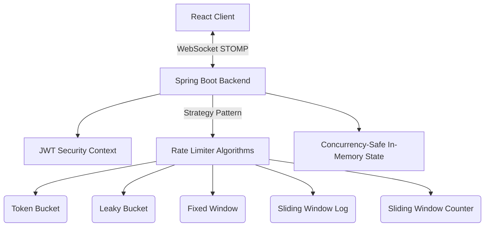

<div align="center">

# ⚡ Rate Limiter Lab
**The Ultimate Real-Time Visualization Platform for Distributed System Rate Limiting**

[](#)
[](#)
[](#)
[](#)

[Live Demo](#) • [System Architecture](#-system-architecture) • [Algorithms Explained](#-algorithms-explained-short-summary) • [Setup Instructions](#-setup-instructions-improved)

</div>

---

## 📸 Screenshots / Demo Section

> **Note to user:** Add your screenshots or GIFs here!
> - *Suggestion 1:* A GIF showing the real-time simulation of the Token Bucket algorithm accepting/rejecting requests.
> - *Suggestion 2:* A screenshot of the Dashboard UI cards.
> - *Suggestion 3:* A screenshot of the expanded "Algorithm Details" educational section.

```html
<!-- Example Image Placeholder -->

```


---

## 🧠 Problem Statement

In the era of microservices and massive distributed systems, APIs are constantly under threat. Whether it's a malicious DDoS attack, a buggy script stuck in an infinite loop, or just an innocent burst of organic traffic, unconstrained resource consumption leads to **cascading failures, backend crashes, and unfair resource allocation** among users.

Rate limiting is the fundamental shield protecting modern infrastructure. However, the theoretical concepts behind these algorithms (how boundary problems occur, why sliding window logs consume so much memory, how leaky buckets guarantee perfect smoothness) are notoriously difficult to grasp without seeing them in action.

---

## 💡 Solution Overview

**Rate Limiter Lab** bridges the gap between abstract distributed system concepts and practical engineering. It provides a real-time, highly interactive simulation environment where developers can dynamically visualize how traffic flows through different constraints.

By adjusting parameters (like bucket capacity, leak rate, or window size) in real-time, users can directly observe how bursts are handled, when requests are throttled, and understand *why* giant tech companies choose specific algorithms for specific use cases.

---

## ⚙️ System Architecture

Rate Limiter Lab is built on a clean, decoupled architecture enabling high-frequency simulations with real-time DOM updates.



- **Frontend (React + Vite)**: Renders a high-performance UI using Framer Motion for smooth, reactive animations. Zustand handles deeply nested global state, keeping charting rendering decoupled from strict business logic.
- **Backend (Spring Boot)**: Provides the robust engine to run concurrent algorithm simulations.
- **WebSocket Flow**: Full-duplex STOMP over WebSockets ensures sub-millisecond propagation of simulated requests and their immediate visual feedback.
- **Shared State**: The backend state is thread-safe, allowing multiple concurrent simulation requests to be evaluated synchronously against the underlying capacity metrics.

---

## 🧩 Core Features (Enhanced)

| Feature | Why it matters | What problem it solves |
|---------|----------------|------------------------|
| **Live Algorithm Simulation** | Seeing requests succeed or fail instantly builds stronger mental models. | Solves the disconnect between reading text logic and understanding dynamic edge cases (like burst boundaries). |
| **Real-Time Data Streams** | Simulates live production environments where traffic is unpredictable. | Helps developers understand how systems react dynamically to sudden traffic spikes under different rulesets. |
| **Integrated Docs panel** | Developer documentation sits right next to the code visualization. | No more context-switching between Wikipedia and the code; educational overlays explain the 'Why'. |
| **Hot Parameter Tuning** | Test hypotheses instantly (e.g., "What if I double the bucket capacity but halve the refill rate?"). | Speeds up the learning loop by turning theoretical math into an interactive sandbox. |

---

## 🧠 Algorithms Explained (Short Summary)

1. **🪣 Token Bucket**
   - *How it works:* Tokens are added at a constant rate. Requests consume a token; if empty, requests are dropped.
   - *Industry Use:* Typical for APIs (like Amazon EC2 networking) where you want to allow occasional bursts of traffic but limit the average sustained rate.

2. **🚰 Leaky Bucket**
   - *How it works:* Incoming requests are queued and processed at a perfectly stable, constant rate.
   - *Industry Use:* Shopify APIs or async job processing queues where the backend must be completely shielded from bursts.

3. **🪟 Fixed Window Counter**
   - *How it works:* A strict tally of requests per fixed time block (e.g., 2:00 to 2:01). Resets to zero at the new block.
   - *Industry Use:* Basic API tiers (e.g., 10,000 requests/month). Very memory-efficient but vulnerable to the "boundary burst" problem.

4. **📜 Sliding Window Log**
   - *How it works:* Keeps an exact timestamp of every request. Highly precise, dropping any timestamp older than the rolling window.
   - *Industry Use:* Highly sensitive security endpoints where precision is strictly demanded and traffic volume is relatively small.

5. **📊 Sliding Window Counter**
   - *How it works:* A hybrid that smooths out fixed windows by using a weighted percentage overlap of the previous window.
   - *Industry Use:* Default high-scale strategy. Used by Cloudflare to provide highly efficient and burst-resistant distributed limiting.

---

## 🔄 Real-Time System Design

- **WebSockets over Polling:** Polling intervals create stutter in visual data and miss microsecond drops. STOMP over WebSockets provides a persistent, low-latency pipeline to stream the simulation ticks reliably.
- **User Synchronization:** Backend session handling maps WebSocket subscriptions to specific authenticated users via JWTs, ensuring isolated testing sandboxes.
- **State Maintenance:** The backend limits are enforced using thread-safe data structures (`ConcurrentHashMap`, `AtomicInteger`) to prevent race conditions during rapid simulated traffic spikes.

---

## 🧱 Design Patterns Used

- **Strategy Pattern:** `RateLimiterStrategy` is an interface implemented by every algorithm. The backend context executes the currently selected strategy seamlessly, avoiding massive `switch` statements and enforcing the Open/Closed Principal.
- **Factory Pattern:** Dynamically provisions the correct Rate Limiter instances for users dynamically at runtime based on their requested tier/configuration.
- **Observer Pattern:** Implemented aggressively via WebSockets on the backend and React/Zustand reactive bindings on the frontend to push state changes to the UI without blocking main threads.

---

## ⚡ Performance & Scalability

While currently utilizing in-memory Thread-Safe objects for single-node execution, the architecture is designed with distributed scalability in mind:
- **Redisson / Redis Hooks:** The interfaces abstract the storage mechanism. `AtomicInteger` counters can be seamlessly swapped with Distributed Redis atomic counters (`INCR`) or Redis Cell (for token buckets).
- **Concurrency & Trade-offs:** The app favors strict consistency for educational accuracy. In production deployments spanning multi-region clusters, strategies like Sliding Window Counter heavily outperform the Log variant by preventing extreme Redis memory bloat.

---

## 🛠️ Tech Stack (Detailed)

**Frontend:**
- **React 19 & Vite:** Lightning-fast HMR and minimal bundle footprint.
- **Tailwind CSS v4 & Framer Motion:** Stunning declarative layouts mapped to physics-based micro-animations.
- **Zustand:** Unobtrusive, boilerplate-free state management.
- **Recharts for React:** High-performance SVG visualization charting.
- **SockJS / STOMP:** Battle-tested WebSocket fallbacks and message routing.

**Backend:**
- **Java 17 & Spring Boot 3:** Enterprise-grade IOC and MVC patterns.
- **Spring Security & JWT:** Stateless, scalable authentication.
- **Spring WebSocket:** Dedicated socket message brokers.

---

## ⚙️ Setup Instructions (Improved)

### Prerequisites
- Node.js (v18+)
- Java 17+ & Maven

### 1. Start the Backend
```bash
git clone https://github.com/coderRajdeep/Rate-Limiter-Lab.git
cd Rate-Limiter-Lab/backend

# Run the Spring Boot application (Defaults to Port 8080)
mvn spring-boot:run
```

### 2. Start the Frontend
```bash
# In an adjacent terminal, navigate to the frontend folder
cd ../frontend

# Install dependencies
npm install

# Start the Vite dev server (Defaults to Port 5173)
npm run dev
```

Visit `http://localhost:5173` to interact with the lab! 

---

## 🧪 Future Enhancements

- [ ] **Distributed Deployment Simulator:** Integrate a live Redis instance to demonstrate how rate limiters behave when latency is introduced between microservice nodes.
- [ ] **Custom Lua Scripts:** Provide the actual Redis Lua scripts used in production to guarantee atomicity and let users run them against a test cluster.
- [ ] **Load Testing Simulator:** Switch from single-client increments to a simulated "Botnet Mode" to stress-test algorithmic boundaries.

---

## 🎯 Learning Outcomes

By studying this codebase and using the lab, engineers will master:
1. **System Design Priorities:** Deciding between strict precision vs memory scale.
2. **Concurrency Execution:** How thread safety mechanisms map to application reliability.
3. **Advanced Distributed Systems:** Why simple counters fail at edge boundaries.
4. **Real-time UX:** How to cleanly bridge WebSocket asynchronous data streams with React's synchronous render lifecycle.

---

## 💼 Resume Impact Section

**Why this project stands out to FAANG/Tier-1 Hiring Managers:**
- **Solves a Hard Engineering Problem:** Moving beyond basic CRUD apps, this project proves a deep understanding of network optimization, backend resilience, and resource allocation.
- **Demonstrates System Design Fluency:** Explicit use of the Strategy pattern, atomic concurrency, and memory tradeoff awareness are immediate green flags.
- **Shows Full-Stack Polish:** Marries complex backend logic with an extremely high-quality, production-grade frontend UX, showing an empathy for user experience alongside hard technical engineering.

---

## 🤝 Contribution Guidelines

Found a bug or want to introduce a new algorithm? Fantastic! 
1. Fork the Project
2. Create your Feature Branch (`git checkout -b feature/AmazingAlgorithm`)
3. Commit your Changes (`git commit -m 'Add AmazingAlgorithm'`)
4. Push to the Branch (`git push origin feature/AmazingAlgorithm`)
5. Open a Pull Request

---

## 📄 License

Distributed under the MIT License. See `LICENSE` for more information.

<div align="center">
  <i>Simulate. Learn. Scale. ⚡ Built by coderRajdeep</i>
</div>
